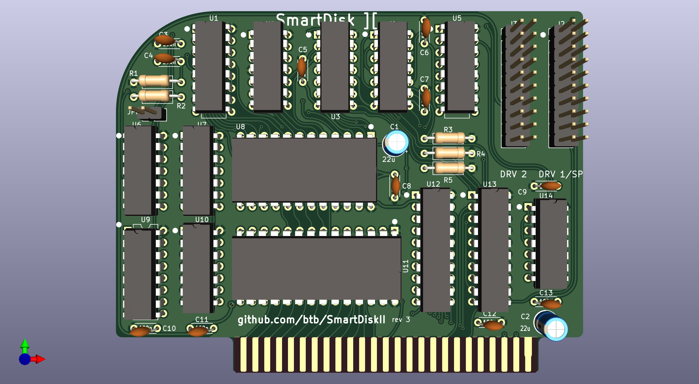

# SmartDiskII

The SmartDiskII is basically an Apple "Liron" disk controller with the IWM chip
replaced by the discrete components from the Disk II controller, which
the IWM was originally based on, and using firmware (i.e. SoftSP) which
has been appropriately modified to use those components instead of the IWM.

[Interactive BOM](https://btb.github.io/SmartDiskII/bom/SmartDiskII_rev3.html)

## SmartPort Operation

Because the SoftSP firmware (as of v6) is slot-dependent, a different copy is
required for each slot the card may be used in. The slot 1 version is in the 1xxx
region of the EPROM, slot 2 version is at 2xxx, etc.
A set of latches (U9) is used to automatically select the appropriate region
depending on which slot the SmartDiskII is placed in.

SmartPort devices can only be installed on connector DRV1.

## Disk II Operation

The card also works as a regular Disk II controller. For this, the 0xxx
region of the EPROM is filled with the Disk II boot rom. Plugging a
floppy drive into the DRV1 connector should automatically activate the correct
firmware because of the presence of +5V on pin 12, but you can also close
jumper JP8 to force the card into Disk II mode.

**Warning: A FloppyEMU in SmartPort mode (or, to be safe, any other SmartPort device)
should never be plugged in if the J8 jumper is in place.** A future revision will
add a resistor or diode to mitigate this danger as well.
